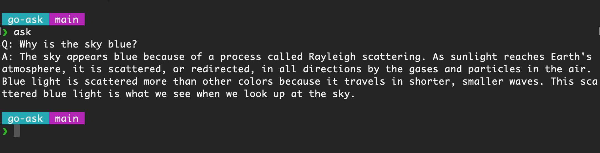

# go-ask

This is a simple Question/Answer utility written in Go. It uses the OpenAI API to retrieve answers to your questions.

## Setup

You'll need the following:
- OpenAI account
- OpenAI API key

Follow the instructions on the [Developer quickstart](https://platform.openai.com/docs/quickstart) page to get set up. Then copy `.env.example` to `.env` and fill in your details. 

## Running the app

To run it, you'll need to source your `.env` file and run the go app. You can add an alias such as `ask` to make it handy:

```
# Run go-ask
alias ask="source /path/to/go-ask/.env && go run /path/to/go-ask/main.go"
```

Each time you run `ask`, you can ask one question. It looks like this:


